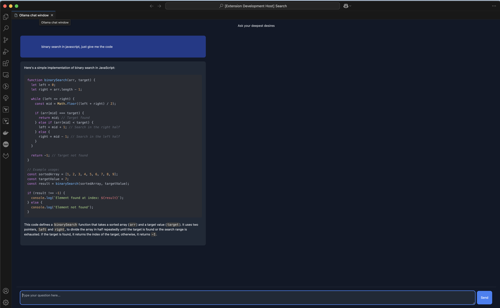

# Ollama Chat

An experimental VS Code extension that allows you to use self hosted models downloaded from [ollama](https://ollama.com/download).



How to use ?

1. Install [Ollama](https://ollama.com/download) and download a model

    ```bash
    ollama run qwen2.5-coder
    ```

2. Open  terminal and run `ollama serve` or manually open Ollama app

3. Open extension in debugger mode and run command `Ollama Chat` in command panel

## TODO

* [ ] Switch to a different model ?
* [ ] retain context when conversating
* [ ] Audio search
* [ ] Processes pdfs ?
* [ ] Add copy code functionality
* [ ] Can we integrate it to be used directly in a file, this would require a faster model
* [ ] Provide options for user to choose the model they want to use
* [ ] Do we need to use a build system like web pack ?
